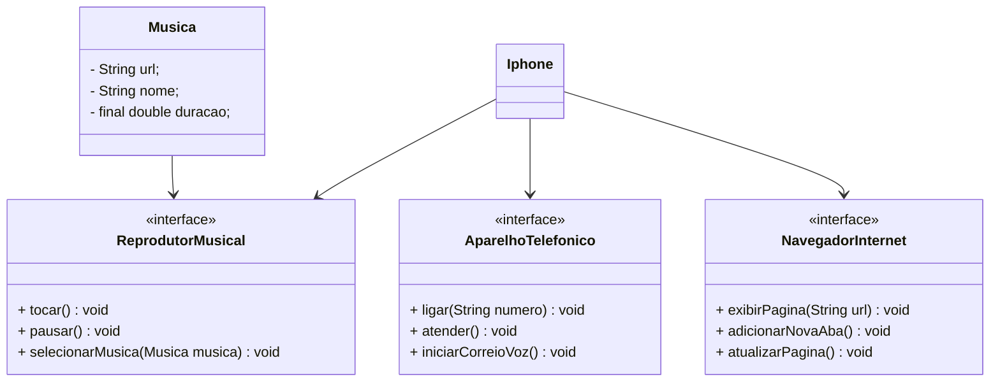

```mermaid
classDiagram

class Musica{
  - String url;
  - String nome;
  - final double duracao;
}

class ReprodutorMusical{
  <<interface>>
  + tocar() void
  + pausar() void
  + selecionarMusica(Musica musica) void
}

class AparelhoTelefonico{
  <<interface>>
  + ligar(String numero) void
  + atender() void
  + iniciarCorreioVoz() void
}

class NavegadorInternet
<<interface>> NavegadorInternet
NavegadorInternet : + exibirPagina(String url) void
NavegadorInternet : + adicionarNovaAba() void
NavegadorInternet : + atualizarPagina() void

class Iphone

Musica --> ReprodutorMusical

Iphone --> ReprodutorMusical
Iphone --> AparelhoTelefonico
Iphone --> NavegadorInternet

```
